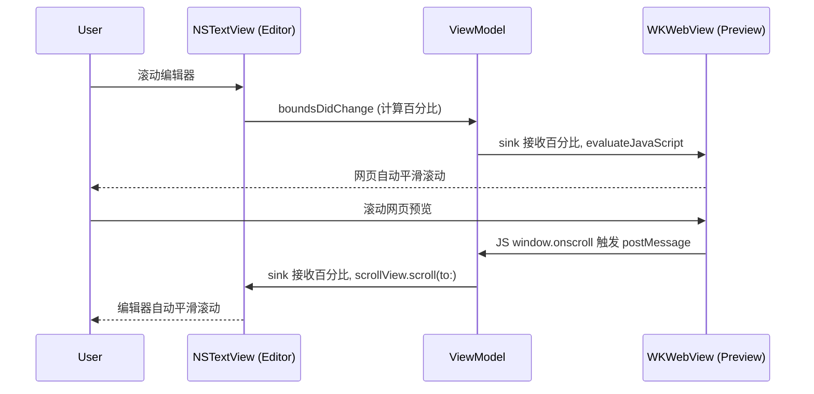

# 从零到一：使用 SwiftUI 与 WebKit 打造一款原生的 macOS Markdown 编辑器

在如今的 macOS 生态中，Markdown 编辑器多如牛毛，但真正想要自己动手用 Swift 写一个既有原生流畅体验，又具备高度定制化（如双向同步滚动、本地图片渲染、Mermaid 绘图、离线代码高亮）的应用，其实暗藏着无数的“坑”。

本文将回顾我使用 **SwiftUI + AppKit (NSTextView) + WebKit (WKWebView)** 打造一款专属 Markdown 应用程序的全过程，并总结其中遇到的核心问题和硬核解决方案。

## 🛠 技术栈选型与应用架构

为了兼顾现代化的界面开发速度和强大的文本渲染能力，本应用采用了混合架构：

- **UI 框架**：SwiftUI (主界面框架) + NavigationSplitView (实现左/中/右三栏布局)。
- **编辑器底层**：`NSTextView` (通过 SwiftUI 的 `NSViewRepresentable` 包装)，结合 `Highlightr` (基于 highlight.js 的原生封装) 实现输入过程中的实时语法高亮。
- **渲染引擎**：`WKWebView`，配合本地化的 `marked.js`、`highlight.min.js` 和 `mermaid.min.js` 实现高性能的富文本预览和图表绘制。
- **数据流与状态管理**：基于 Combine 框架的 `AppViewModel` 作为唯一数据源，利用 `@AppStorage` 实现偏好设置的全局持久化。

### 核心架构交互图

```mermaid
graph TD
    A[用户操作] -->|输入/滚动/快捷键| B(SwiftUI 视图层<br>ContentView / EditorView)
    B --> C{AppViewModel<br>状态与事件中心}
    C -->|@Published 数据绑定| B
    
    subgreen[AppKit 层]
    C -->|textBinding| D[NSViewRepresentable<br>SyntaxHighlightedTextEditor]
    D --> E[NSTextView<br>原生文本交互]
    E --> F[Highlightr<br>实时语法高亮]
    end
    
    subblue[WebKit 层]
    C -->|markdownText<br>scrollPercentage| G[NSViewRepresentable<br>PreviewWebView]
    G --> H[WKWebView<br>渲染引擎]
    H -->|注入本地资源| I[marked.js<br>highlight.js<br>mermaid.js]
    H -->|postMessage| C
    end
    
    style subgreen fill:#e8f4f8,stroke:#4a90e2,stroke-width:2px
    style subblue fill:#f9ebea,stroke:#d0021b,stroke-width:2px
```

*(上图展示了 SwiftUI 视图层如何通过 ViewModel 桥接底层的 AppKit 编辑器和 WebKit 渲染器，形成单向数据流。)*

---

## 🚧 核心挑战与踩坑实录

### 坑一：SwiftUI 原生 TextEditor 太弱，如何驾驭 NSTextView？
一开始，我们试图直接使用 SwiftUI 的原生组件，但发现它既不支持局部语法高亮，也不支持原生的查找替换。
**解决方案**：
我们退回到 AppKit，用 `NSViewRepresentable` 包装了 `NSTextView`。
- **打字无法交互**：在包装时，如果只是简单地替换 `LayoutManager`，会导致文本系统断链，无法输入。必须保留原本的 Text System，仅将原生的 `layoutManager` 转移至 `CodeAttributedString` (Highlightr 的组件) 中。
- **开启原生超能力**：通过简单的几行代码，激活 macOS 沉淀多年的原生能力：
  ```swift
  textView.isEditable = true
  textView.allowsUndo = true
  textView.usesFindBar = true // 开启原生 Cmd+F 搜索栏
  textView.isIncrementalSearchingEnabled = true
  ```

### 坑二：沙盒机制下，WKWebView 无法加载本地相对路径图片
当你写下 ``，通过 `webView.loadHTMLString(html, baseURL: dir)` 加载时，你会发现图片全碎了。这是因为 macOS 严格的 WebKit 沙盒机制拦截了 HTML 字符串对本地磁盘的读取权限。

**硬核破局（欺骗 WebKit）**：
放弃直接加载 HTML 字符串，而是在 Markdown 文件同级目录下，**偷偷生成一个隐藏的 `.preview-xxx.html` 临时文件**，然后使用 `loadFileURL` API 加载它，并在 1 秒后自动销毁。
```swift
let tempFileURL = dir.appendingPathComponent(".preview-\(UUID().uuidString).html")
try html.write(to: tempFileURL, atomically: true, encoding: .utf8)
// 允许访问当前文件夹及其子目录
webView.loadFileURL(tempFileURL, allowingReadAccessTo: dir) 
```
如此一来，WebKit 认为你在读取本地网页，顺理成章地放行了对同级目录图片的请求！

### 坑三：导出 PDF 疯狂 Crash（The view's frame was not initialized properly）
当调用 `webView.printOperation` 试图把预览页面导出为 PDF 时，应用直接报 `EXC_BREAKPOINT` 闪退。原因是后台静默导出的 WebView 尚未被系统分配尺寸。
**解决方案**：
1. 抛弃陈旧的打印流，拥抱现代的 `webView.createPDF(configuration:)`。
2. 强制在主线程 (Main Thread) 赋予一个虚拟的 Frame：
```swift
if webView.frame.isEmpty {
    webView.frame = CGRect(x: 0, y: 0, width: 800, height: 600)
}
```

### 坑四：双向同步滚动 (Sync Scroll) 如何实现？
左边写代码，右边自动滚，这是优雅体验的灵魂。也是编辑器开发中最复杂的一环。



**解决方案**：
建立一条 Swift 与 JavaScript 之间的双向通讯桥梁，如上图所示。核心逻辑是通过判断当前的 `scrollSource`（滚动源）来避免无限死循环。

### 坑五：无网状态下 Mermaid 与代码高亮集体罢工
一开始我们贪图方便，用了 CDN 引入第三方 JS 库。结果由于特殊的网络代理和沙盒的防火墙 `403 Forbidden`，右边直接变白板。
**解决方案**：
实现**完全的离线化架构**。
通过 Python 脚本将 `marked.min.js`, `highlight.min.js`, `mermaid.min.js` 及 CSS 主题抓取到本地项目中，打包进 `Resources` 目录。
然后遇到 Mermaid 10 版本的异步加载机制问题，放弃过时的 `.init()`，改为：
```javascript
const initMermaid = async () => {
    await mermaid.run({ querySelector: '.mermaid' });
};
initMermaid();
```
彻底实现了断网也能画流程图和解析 Swift / JSON 等三十多种语言的代码高亮！

### 坑六：图表太小？实现点击图片原生弹窗缩放
网页里渲染的流程图往往看不清细节。
**解决方案**：
在 JS 里注入全局点击事件，捕获 `<svg>` 和 ``，利用 JSBridge 传递源码给 Swift。
Swift 端接手后，弹出一个极简风格的 `sheet`，里面包裹一个开启了 `allowsMagnification = true` 的特殊 WKWebView。此时，利用 Mac 触控板的捏合手势，你就能享受丝滑无损的矢量图缩放，并且我还加上了“一键导出 SVG / PNG 保存到本地”的按钮。

---

## 🎨 打磨细节，注入灵魂

一个好用的工具必定是赏心悦目的，在这个 App 中，我加入了以下自定义特性：
1. **多重主题引擎**：引入了 GitHub、Notion、Dracula (吸血鬼)、Modern、Classic (学术) 五大网页渲染主题，配合右侧十几种编辑器语法高亮，总有一款适合你。
2. **纯色沉浸背景**：接入了 macOS 原生 `ColorPicker`，允许用户随意指定左侧编辑器背景色（存入 `@AppStorage`）。
3. **原生级别的操作**：支持从 Finder 直接把文件拖拽到 App 图标打开；工具栏提供前进/后退邻近文件漫游；支持标准的 `Cmd+F` (原内联搜索栏) 与 `Cmd+R` (查找替换)。

## 💡 总结

开发一款看似简单的 Markdown 编辑器，实际上涉及了 AppKit 遗留架构、SwiftUI 新生态、WebKit 安全沙盒以及前端 JavaScript 等多端的深度融合。

SwiftUI 大大加速了界面的搭建与数据流转（得益于强大的 `@EnvironmentObject` 和 `@AppStorage`），但在面对极致的文本处理和富文本渲染时，我们依然需要借助 AppKit 和 WebKit 的底层能力，甚至是前端生态的赋能。希望这篇文章记录的爬坑过程，能为你的 macOS 开发之旅提供一些灵感！

--- 
*(注：如果需要以上提到的具体实现代码或 Ruby 项目配置脚本，欢迎在评论区交流！)*