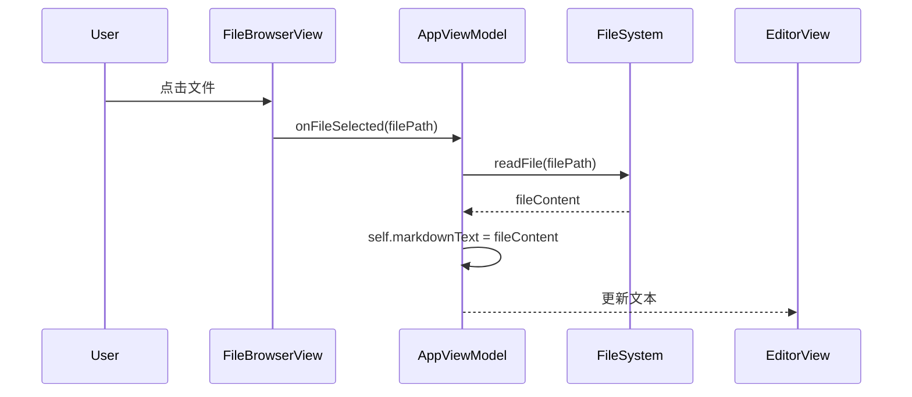
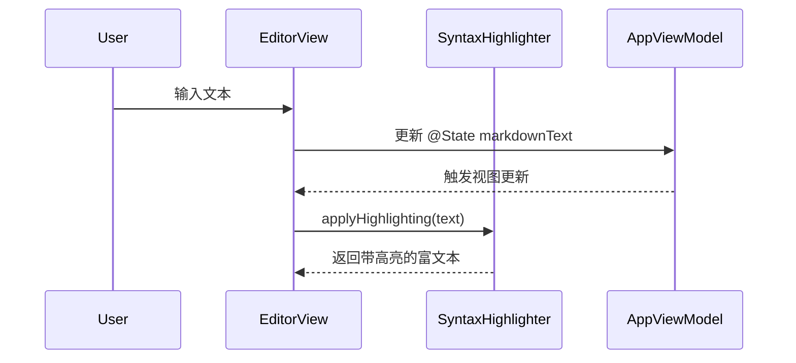

# 第二阶段设计文档：完善编辑器和文件管理

本文档详细阐述了 Markdown 应用第二阶段的设计，重点关注编辑体验提升和文件管理功能的实现。

## 1. 组件关系图

此阶段我们将引入专门的 `FileBrowserView` 和 `EditorView`，并引入一个 `AppViewModel` 来管理整个应用的状态和逻辑，实现更清晰的数据流。

```mermaid
graph TD
    subgraph "ContentView"
        A[FileBrowserView]
        B[EditorView]
        C[Preview (WebView)]
    end

    D[AppViewModel]

    A -- "选择文件" --> D
    D -- "更新文件内容" --> B
    D -- "更新文件内容" --> C
    B -- "编辑文本" --> D
```

- **AppViewModel**: 作为单一数据源 (Single Source of Truth)，持有当前打开文件的内容、文件列表等状态。
- **FileBrowserView**: 显示文件列表，并将用户的文件选择事件通知给 `AppViewModel`。
- **EditorView**: 接收来自 `AppViewModel` 的文本内容进行显示，并将用户的编辑操作实时更新回 `AppViewModel`。
- **Preview**: 同样订阅 `AppViewModel` 中的文本内容变化，以实现实时预览。

## 2. 核心流程图

### 2.1. 打开文件流程



### 2.2. 语法高亮流程 (集成 Highlightr)

我们将使用 `TextKit` 和 `Highlightr` 库来实现编辑器内的语法高亮。`EditorView` 将不再是简单的 `TextEditor`，而是一个更复杂的、基于 `UITextView` 或 `NSTextView` 的封装。



这份设计为我们接下来的编码工作提供了清晰的指引。