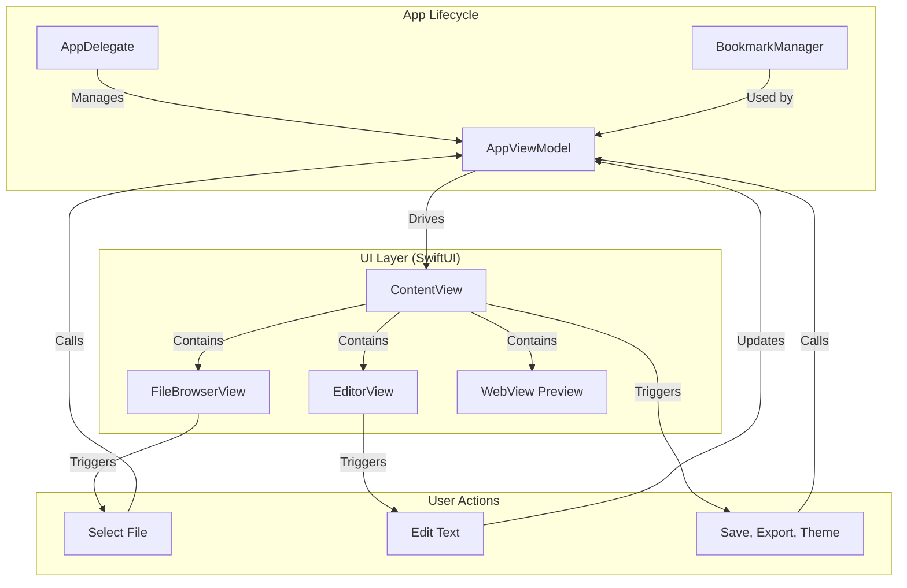

# 通用 Markdown 应用最终设计文档

本文档旨在为一个面向开发者的、功能完善的通用 Markdown macOS 应用提供全面的设计和规划的最终版本，反映了项目开发过程中的所有关键决策和实现。

## 1. 核心功能需求

### 1.1. 编辑器核心
- **实时预览**: 分屏实时预览，右侧为渲染后的效果。
- **语法高亮**: 编辑器内对 Markdown 语法进行高亮。
- **主题切换**: 支持多种编辑器代码高亮主题（如 Xcode, Solarized Dark 等），并可动态切换。

### 1.2. 文件管理
- **持久化访问**: 应用能“记住”上次访问的文件夹，启动时自动加载，无需用户重复授权。
- **文件浏览器**: 在侧边栏显示文件列表，并高亮当前选中的文件。
- **文件操作**: 支持新建文件（以时间戳命名）、删除文件（通过右键菜单）。
- **文件保存**: 支持手动保存（`Cmd+S`）当前文件。

### 1.3. 导出功能
- **多格式导出**: 支持将当前文档导出为 PDF 和 HTML 格式。

### 1.4. 辅助功能
- **快捷键**: 为核心操作（如保存）提供标准的 macOS 快捷键。

## 2. 应用架构

我们最终采用了以 `AppViewModel` 为核心的 MVVM 架构，并引入了 `AppDelegate` 和 `BookmarkManager` 来处理应用生命周期和持久化权限，确保了应用的健壮性和良好的用户体验。

- **AppDelegate**: 应用的入口，负责创建和管理 `AppViewModel` 的单一实例，并在应用退出时释放资源。
- **AppViewModel**: 应用的“大脑”，作为单一数据源，管理所有状态（如文件列表、当前文本、主题），并包含所有业务逻辑（如文件读写、导出）。
- **BookmarkManager**: 一个独立的工具类，专门负责保存和加载安全范围书签，以实现持久化的文件夹访问权限。
- **ContentView**: 应用的主视图，负责组织整体布局和工具栏。
- **FileBrowserView, EditorView, WebView**: 各司其职的子视图，分别负责文件列表、文本编辑和 Markdown 预览，它们都通过 `@EnvironmentObject` 从 `AppViewModel` 获取数据和调用方法。

## 3. 技术栈

- **编程语言**: **Swift**
- **UI 框架**: **SwiftUI**
- **应用生命周期**: **AppDelegate**
- **异步与通信**: **Combine** (用于导出功能的视图间通信)
- **Markdown 解析**: **swift-markdown** (Apple 官方库)
- **代码语法高亮**: **Highlightr**
- **PDF 导出**: **PDFKit** (通过 `WKWebView` 的打印功能实现)
- **开发工具**: **Xcode**

## 4. 最终开发路线图 (回顾)

1.  **Phase 1: 核心 MVP**: 搭建了基本的三栏布局和最基础的文本编辑、预览功能。
2.  **Phase 2: 完善核心体验 (修正)**: 在您的指导下，我们暂停了原计划，转而解决了更关键的问题：
    - 实现了以 `AppViewModel` 为核心的统一状态管理。
    - 实现了文件保存 (`Cmd+S`) 功能。
    - 实现了文件访问的用户授权流程 (`NSOpenPanel`)。
    - 实现了文件列表的选中状态反馈。
3.  **Phase 3: 完善文件管理 (修正)**: 进一步完善了文件管理的交互：
    - 实现了新建文件（带时间戳）和删除文件的功能。
4.  **Phase 4: 导出与个性化**: 在坚实的基础上，我们顺利地添加了“锦上添花”的功能：
    - 实现了导出为 HTML 和 PDF 的功能。
    - 实现了编辑器主题的动态切换。
5.  **Phase 5: 持久化与健壮性 (修正)**: 最后，我们解决了应用级的核心体验问题：
    - 通过**安全范围书签**实现了持久化的目录访问权限。
    - 通过 `AppDelegate` 确保了资源的正确管理和释放。

这份文档全面记录了我们共同构建这个出色应用的全过程。感谢您的每一次精准指导！
