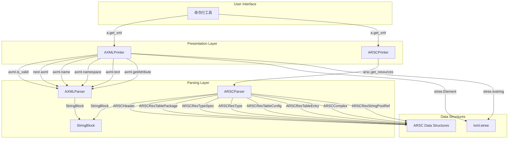
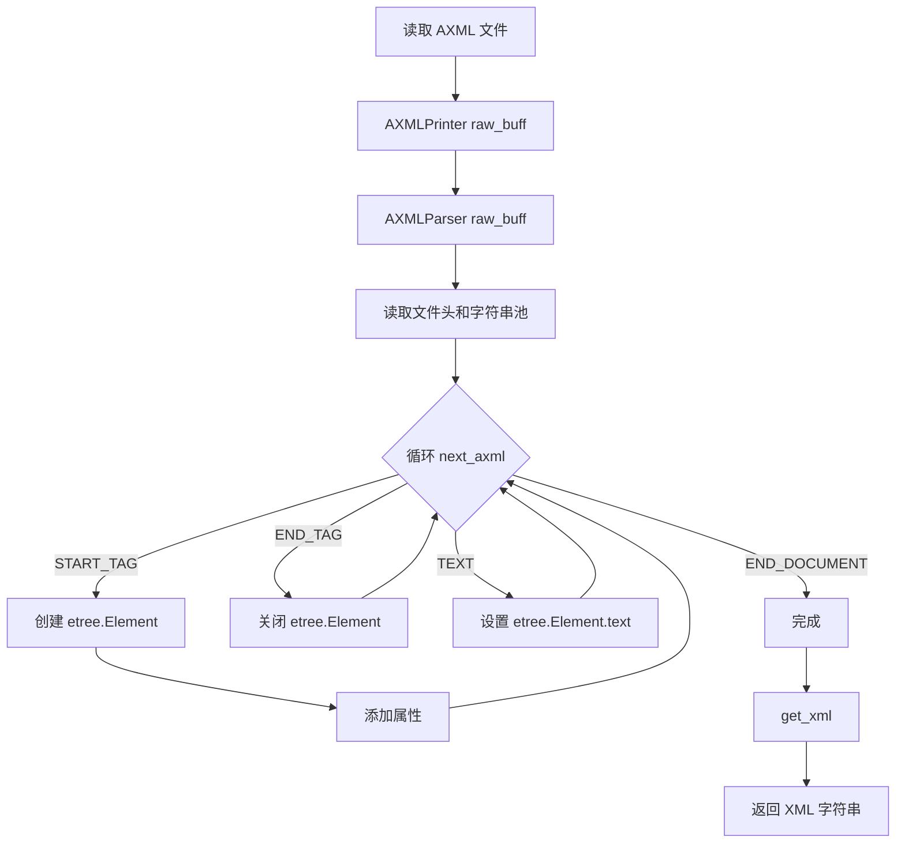
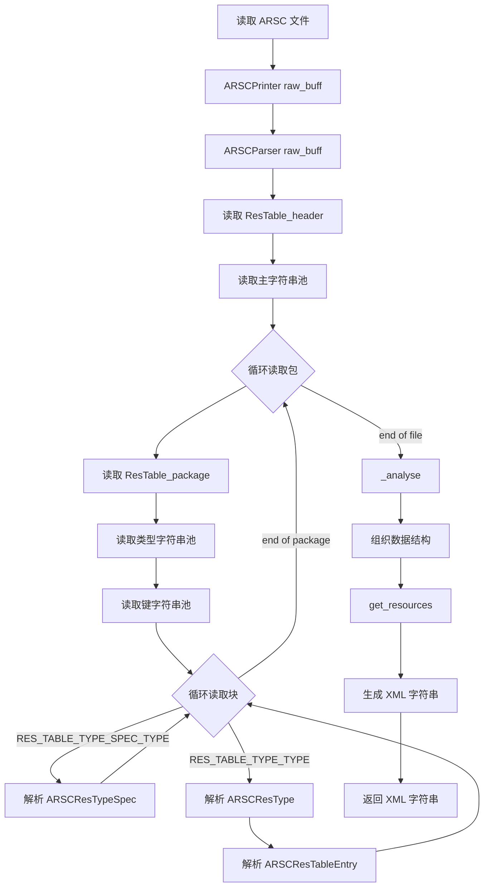
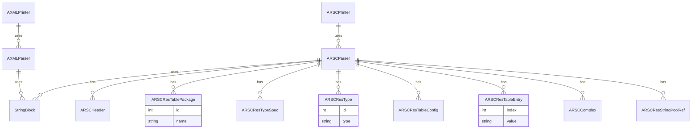

# 深入解析 Android resources.arsc

在 Android 开发和逆向工程中，**`resources.arsc`** 是 APK 文件里的一个非常核心的二进制文件。

它的全称可以理解为 **Android Resource Table（Android 资源映射表）**。你可以把它当成整个 Android 应用资源的**“字典”**或**“索引目录”**。

它的主要作用和工作原理包括以下几个方面：

### 1. 建立资源 ID 与具体资源的映射
在写 Android 代码时，我们通常通过 `R.string.app_name`、`R.layout.activity_main` 这样的 ID 来引用资源。在代码编译后，这些 `R.xxx` 都会变成一个 **16 进制的整数（例如 `0x7F040001`）**。
当 App 运行并需要显示这个资源时，Android 系统就会去查 `resources.arsc` 这个“字典”，通过 `0x7F040001` 这个键值，找到对应的具体内容。

### 2. 存储“简单/基础”资源的值
并非所有资源都以独立文件的形式存在于 APK 中。对于一些基础数据类型，它们在编译时会被直接“打包”进 `resources.arsc` 文件内部，例如：
*   **字符串** (`strings.xml` 里的文字)
*   **颜色** (`colors.xml` 里的 `#FFFFFF` 等)
*   **尺寸** (`dimens.xml` 里的 `16dp`、`14sp` 等)
*   **布尔值/整数** (`bools.xml`, `integers.xml`)
*   **样式和主题** (`styles.xml`, `themes.xml`)

### 3. 记录“复杂”资源的文件路径
对于图片（`.png`, `.webp`）、布局文件（`.xml`）、音频（`.mp3`）等大文件，`resources.arsc` 不会把文件内容本身塞进去，而是**保存这些文件在 APK 压缩包中的相对路径**。
比如：系统查表发现 `0x7F030002` 指向的是 `res/layout/activity_main.xml`，然后再去 APK 的对应路径下把这个 XML 文件加载出来。

### 4. 强大的多设备/多语言适配支持
这是 `resources.arsc` 最关键的能力之一。
在开发中，你可能会定义多个 `values` 文件夹（如 `values-en` 英文、`values-zh` 中文、`values-night` 夜间模式、`drawable-hdpi` 高分辨率）。
`resources.arsc` 中以特定的数据结构记录了**同一个资源 ID 在不同配置下的所有版本**。当 App 运行时，系统只需提供当前手机的状态（语言是中文、屏幕是高DPI、处于暗黑模式），`resources.arsc` 就能极速检索出最匹配的那一份资源。

---

### 补充知识：
*   **如何查看它？**
    *   **Android Studio**：直接将 APK 拖入 Android Studio，使用自带的 **APK Analyzer** 点击 `resources.arsc` 即可图形化查看内容。
    *   **逆向工具**：使用 **Apktool** 反编译 APK 时，Apktool 会解析 `resources.arsc`，并帮你把它还原成原来我们在工程里看到的 `res/values/strings.xml` 等肉眼可读的文件。

---

要深入了解 `resources.arsc`，我们就必须掀开它的外衣，深入到 **编译打包流程** 以及它的 **底层二进制（16 进制）文件结构**。

对于逆向工程师或者 Android 底层开发者来说，`resources.arsc` 并不是一个黑盒，而是一个**由标准“数据块（Chunk）”按特定顺序拼装而成的二进制大文件**。

下面我们从“它是怎么生成的”开始，然后带你用 16 进制的视角一层一层把这个文件“解剖”开。

---

### 一、 它是怎么生成的？

`resources.arsc` 是由 Android 的资源打包工具 **AAPT**（早期）或 **AAPT2**（现代 Android Studio 默认）生成的。整个过程分为两步：

#### 1. 编译阶段 (Compile)
AAPT2 会去扫描你工程里 `res/` 目录下的所有文件。
*   对于图片（PNG/JPEG），它会进行压缩或优化。
*   对于 XML 布局文件或 `values/strings.xml` 这样的文件，它会将其从文本 XML **编译成二进制的 Flat 格式**（以去掉空格、注释，把标签名变成索引，极大缩小体积）。

#### 2. 链接阶段 (Link)
AAPT2 把刚才编译好的所有零散文件“组装”到一起：
*   它会为每一个资源分配一个唯一的 **32 位整数 ID**（即你在 `R.java` 中看到的 16 进制数字，例如 `0x7F040001`）。
*   它把所有原本在 `strings.xml`、`colors.xml` 里的具体值、以及大文件（如图片）在 APK 里的相对路径收集起来。
*   最后，按照 Android 规定的二进制协议格式，把这些信息统一写入到一个独立的文件中，这个文件就是 **`resources.arsc`**。

---

### 二、 从 16 进制视角解剖 `resources.arsc` (二进制结构详解)

如果你用十六进制编辑器（如 010 Editor）打开 `resources.arsc`，你会发现它是一个**基于 Chunk（数据块）构成的树状结构**。每一个区域都是一个 Chunk，大的 Chunk 里面嵌套小的 Chunk。

每一个 Chunk 都有一个**统一的 8 字节头部（Header）**：
*   **Type (2 Bytes)**：表示这个 Chunk 的类型（比如：它是个字符串池？还是资源配置表？）
*   **Header Size (2 Bytes)**：这个 Chunk 头部本身的大小。
*   **Size (4 Bytes)**：这个 Chunk 的总大小（包含头部和里面的数据）。

按照文件从头到尾的顺序，`resources.arsc` 包含以下几个核心区块：

#### 1. Table Chunk (根数据块)
*   **十六进制标记**：`0x0002` (RES_TABLE_TYPE)
*   **作用**：这是整个文件的“大包装盒”，包含了整个 `resources.arsc` 文件的全局信息。它记录了文件里包含多少个 Package（通常普通 App 只有一个包，即自身）。

#### 2. Global String Pool (全局字符串池)
*   **十六进制标记**：`0x0001` (RES_STRING_POOL_TYPE)
*   **作用**：**极其重要！** 为了极致压缩体积，`resources.arsc` 采用了**字符串复用**机制。文件中所有的字符串（包括 XML 文件路径、`strings.xml` 中的文案）全都集中保存在这里。
*   **结构**：
    *   包含字符串的数量。
    *   字符串的偏移量数组（告诉你第 5 个字符串在哪个位置）。
    *   一大段连续的字符串字节流（通常是 UTF-8 或 UTF-16 编码，以 `0x00` 结尾）。
*   **注**：后续所有的资源只要用到文字，都不会直接存文字，而是存一个指向这里的 `Index`（索引整型）。

#### 3. Package Chunk (包数据块)
*   **十六进制标记**：`0x0200` (RES_TABLE_PACKAGE_TYPE)
*   **作用**：存放某个具体包的所有资源映射关系。普通 App 的 Package ID 固定是 `0x7F`（系统框架 `framework-res.apk` 的 ID 是 `0x01`）。
*   **内部嵌套结构**：在 Package Chunk 内部，又包含了几个关键的子 Chunk：

    *   **A. Type String Pool (类型字符串池)**
        *   里面存的是："string", "id", "layout", "color", "drawable", "mipmap" 这样的资源分类名称。
    *   **B. Key String Pool (键名字符串池)**
        *   里面存的是你在代码里写的资源名，比如："app_name", "activity_main", "ic_launcher"。
    *   **C. TypeSpec Chunk (资源类型规范块 - 0x0202)**
        *   定义某一种资源（比如所有 string）的配置属性，比如它是否支持多语言、多屏幕密度。
    *   **D. Type Chunk (资源数据块 - 0x0201)**
        *   **这是最核心的数据存放区！** 它对应特定配置（比如 `values-zh-rCN`）下的具体资源值。
        *   在这里面，每一个具体的资源会被描述为一个名为 `Res_value` 的 8 字节结构体：
            *   `Size (2 Bytes)`：结构体大小。
            *   `Res0 (1 Byte)`：保留位，始终为 0。
            *   **`DataType (1 Byte)`**：数据类型！(如 0x01 表示引用, 0x03 表示字符串, 0x10 表示十进制整数, 0x12 表示布尔值)。
            *   **`Data (4 Bytes)`**：具体的值！如果 DataType 是整型，这里直接就是数字（如 `0xFFFFFFFF`）；如果是字符串，这里就是**全局字符串池的索引**。

---

### 三、 动态推演：16进制的魔法（通过 ID 找资源的完整链路）

为了彻底弄懂 `resources.arsc`，我们来看看 Android 系统在底层是如何通过一个 16 进制的资源 ID，最终拿到画在屏幕上的数据的。

我们在代码里调用了：`getString(0x7F040001)`。

这个神秘的 `0x7F040001` 到底是怎么设计的？把它按字节拆开：
**`0x7F` `04` `0001` -> `0x PP TT EEEE`**

1.  **PP (Package ID) = `0x7F`**
    系统拿着 `7F`，在 `resources.arsc` 中扫描寻找 ID 为 `7F` 的 Package Chunk（上面提到的第 3 部分）。
2.  **TT (Type ID) = `0x04`**
    系统在 Package Chunk 中，寻找类型 ID 为 `04` 的 Type Chunk。假设根据 **Type String Pool** 的记录，第 4 个类型刚好是 `string`。系统就锁定了所有的字符串配置区块。
    *(系统还会在这里结合当前手机状态，比如发现手机是中文，就会自动过滤掉 `values-en` 的区块，精准定位到 `values-zh` 的 Type Chunk)*。
3.  **EEEE (Entry ID) = `0x0001`**
    系统进入这个 `values-zh` 的 Type Chunk 中，直接去查数组中索引为 `0x0001`（第 2 项）的记录。
4.  **读取 `Res_value`**
    找到该项后，读出 8 个字节。发现 `DataType` 是 `0x03`（代表字符串），它的 `Data` 值是 `0x00000A52`。
5.  **查字典**
    系统拿着 `0x00000A52` 这个索引，去 **Global String Pool (全局字符串池)** 里面找第 `0x0A52` 个字符串，读出 16 进制字节 `E5 BE AE E4 BF A1`（UTF-8 的“微信”）。

至此，`0x7F040001` 被成功解析为屏幕上的中文！

### 总结
从 16 进制底层来看，`resources.arsc` 是一座设计极其精妙的**二进制关系数据库**。它通过严格的 Header 和 Chunk 划分，配合大量的偏移量（Offsets）指针和全局池（Pool）复用，让 Android 系统可以在内存极其有限的情况下，通过简单的位移和查表算法，实现 `O(1)` 时间复杂度的资源闪电级检索。这也是为什么许多逆向汉化插件、改包工具（如 Apktool），核心技术就是解析并修改这些 16 进制的 Chunk 指针。

# axml
我已仔细阅读了 `axml` 库的代码，并对其架构、流程和关系有了深入的了解。

**架构总结**

该库的核心是两个解析器：`AXMLParser` 和 `ARSCParser`。

*   [`AXMLParser`](axml/axml/parser.py) 用于解析二进制 XML 文件（例如 `AndroidManifest.xml`）。它是一个状态机，逐块读取文件并提供有关每个块的信息。
*   [`ARSCParser`](axml/arsc/parser.py) 用于解析资源文件（`resources.arsc`）。它一次性解析整个文件，并将所有信息存储在内存中。

[`AXMLPrinter`](axml/axml/printer.py) 和 [`ARSCPrinter`](axml/arsc/printer.py) 是围绕这两个解析器的包装器。它们使用解析器来获取数据，然后将数据转换为人类可读的格式（主要是 XML）。

[`StringBlock`](axml/parser/stringblock.py) 是一个辅助类，用于解析 AXML 和 ARSC 文件中的字符串池。

**图表**

**架构图 (Architecture Diagram)**

**流程图 (Flowchart)**

**AXML 解析流程**

**ARSC 解析流程**

**关系图 (Entity-Relationship Diagram)**

